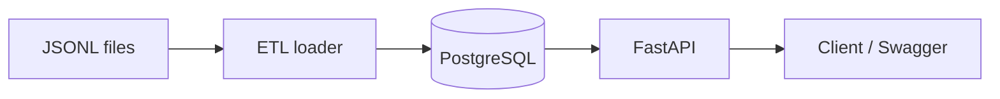

# Author

- Applicant Name:
- Git Profile URL: (leave blank if none)

# Design Notes

> This document records the key design decisions behind the implementation.
> Please describe **why you made certain choices**, including reasoning that may not be obvious from the code alone.
>
> - There is no required length or format. The sections below are only a starting point; feel free to add or remove sections as needed.
> - Focus on the story of the system design process rather than explaining the code itself.

## 0. Notes to the Reviewer

All phases are complete. The project is ready for submission.

| Command | Purpose |
|---------|---------|
| `make setup` | Download data, start PostgreSQL, migrate, ETL, run tests |
| `make run` | Start API at `http://localhost:8080` |
| `make test` | Run pytest suite (requires setup) |
| `make verify` | Curl smoke tests against running API |
| `make down` | Stop containers and remove volumes |
| `make analyze` | Re-run Phase 1 data exploration |

**Reviewer flow:** `make setup` → `make run` → `make verify` (separate terminal) → `make down`

After setup, `GET /ready` should report ~33,906 items and ~4,961 prices.

## Project Outcome

The final implementation successfully loads:

- 24,278 classification nodes
- 33,906 quantity items
- 4,961 market prices
- 111 normalized unit codes

The API supports:

- Classification navigation
- Keyword item search
- Division and hierarchy filtering
- Optional market price lookup
- OpenAPI documentation

All required functionality was implemented and verified through automated tests and smoke checks.

## 1. Domain and Requirements Analysis

The objective of this system is not to calculate construction costs directly, but to provide a **reference platform** that lets estimators navigate construction classifications and retrieve standard market prices for individual work items.

According to the provided domain documentation, construction projects are organized into a hierarchical structure. At the top level are construction divisions (`공종`, `cnstwkDivCd`), which are further broken down into a five-level classification hierarchy. The lowest level of this hierarchy is the quantity calculation item (`산출항목`, `qtyCalcCtyclcd`), representing the smallest billable unit of work. Each item may have an associated standard market price consisting of material cost, labor cost, and expense cost.

### User Questions the System Must Answer

1. How can I locate the quantity calculation item relevant to my construction work?
2. What is the currently published standard market price for that item?

### Required Capabilities

#### Classification Navigation

Users should be able to explore construction divisions and their hierarchical classifications to locate specific quantity calculation items. The classification hierarchy should therefore be modeled as a first-class domain concept rather than flattened text fields.

#### Item Search

Users should be able to search quantity calculation items by keyword (`qtyCalcCtyclNm`) and filter results using construction division codes and any of the five classification levels. Because users may know either the item name or its location in the hierarchy, both navigation and search are required.

#### Price Lookup

Search results must include item metadata such as specification (`spec`) and unit (`unit`) together with pricing information. Some items may not have published prices, so the system must clearly distinguish between **no price available** (`price: null`) and a **valid price value of zero**.

#### API Requirements

The service must expose OpenAPI documentation through:

- `GET /openapi.json`
- `GET /docs`

This influenced the planned framework choice: FastAPI provides OpenAPI generation out of the box.

#### Legacy Constraints

Organizational conventions that the API must follow:

| Convention | Requirement |
|------------|-------------|
| Paths | Singular nouns (e.g. `/classification`, `/item`) |
| Response format | JSON with `snake_case` fields |
| HTTP status | Always 200; success/failure via body `status` field |
| Timestamps | Stored and returned in Asia/Seoul |
| Database tables | Include `created_at` and `updated_at` on every table |

### Domain Model Interpretation

```
Construction Division (cnstwkDivCd)
  └── Classification Hierarchy (Levels 1–5)
        └── Quantity Calculation Item (qtyCalcCtyclcd)
              └── Standard Market Price (optional)
```

The primary responsibility of this system is to provide efficient access to quantity calculation items and their associated prices while preserving the hierarchical classification structure used by construction estimators.

## 2. Data Analysis

Before designing the database schema, I ran an exploratory analysis of the two provided JSONL datasets. The analysis script lives in `src/analysis/` and can be reproduced with `make analyze`. Full numeric output is saved to `docs/reports/phase1_data_analysis.md`.

### Dataset Overview

| Dataset | Rows | Role |
|---------|-----:|------|
| `construction_classification.jsonl` | 44,751 | Master catalog of divisions, hierarchy, and items |
| `std_market_price.jsonl` | 4,961 | Optional standard market prices |

The classification dataset is roughly nine times larger than the price dataset, which immediately suggests that pricing information exists for only a subset of classified items.

### Entity Relationship

Both datasets are linked by `qtyCalcCtyclcd` (quantity calculation item code):

| Metric | Count |
|--------|------:|
| Unique item codes in classification | 33,906 |
| Unique item codes in price | 4,961 |
| Codes present in both datasets | 4,961 |
| Codes only in classification (no price) | 28,945 |
| Codes only in price (orphan prices) | 0 |

**Conclusion:** `construction_classification.jsonl` is the authoritative source of item definitions. `std_market_price.jsonl` enriches a subset of those items. All price codes exist in classification; no orphan price records were found. Pricing must be modeled as an **optional one-to-zero-or-one** relationship.

Only **14.6%** of classified item codes currently have a price record. The API must return items without prices and represent missing prices explicitly.

### Hierarchy vs. Leaf Items

| Row type | Count | Description |
|----------|------:|-------------|
| Hierarchy-only rows | 10,845 | Five classification levels populated, but `qtyCalcCtyclcd` is empty |
| Leaf item rows | 33,906 | Rows with a non-empty `qtyCalcCtyclcd` |

Hierarchy-only rows represent intermediate classification nodes (category headers), not billable items. Example: a row with levels `철근콘크리트 공사 → 콘크리트 타설 → … → 각종 장비PAD` but no attached item code.

**Conclusion:** ETL must separate **classification nodes** from **leaf-level quantity items**. Loading everything into a single flat table would mix navigational structure with searchable billable items.

### Work Division Distribution

| Code | Name (Korean) | Rows |
|------|---------------|-----:|
| A | 건축공사 (Building construction) | 17,814 |
| C | 토목공사 (Civil engineering) | 7,903 |
| E | 전기공사 (Electrical) | 1,573 |
| M | 설비공사 (Mechanical facilities) | 5,602 |
| R | 국가유산수리공사 (National heritage repair) | 680 |
| T | 통신공사 (Telecommunications) | 11,179 |

Filtering by `cnstwkDivCd` is a primary access path and must be indexed.

### Unit Inconsistency

Equivalent units appear under multiple spellings across both files:

| Concept | Raw variants observed |
|---------|----------------------|
| Length | `m`, `M` |
| Area | `㎡`, `M2`, `m2` |
| Volume | `㎥`, `M3`, `m3` |
| Count | `개`, `개소`, `nr(개소)` |

If stored as-is, filtering and aggregation would be unreliable. A canonical unit mapping must be applied during ETL. A draft mapping is defined in `src/analysis/analyzer.py` (`UNIT_NORMALIZATION_MAP`); unmapped variants are listed in the generated report for manual review.

### Data Quality Observations

- Empty `qtyCalcCtyclcd` values appear only in hierarchy-only rows (10,845 rows).
- No duplicate item codes were found in either dataset for this snapshot.
- No price rows had all three cost components equal to zero.
- All price records share the same publication date (`20260527`) in this dataset, simplifying initial implementation but suggesting future version management will be needed.

### Design Implications (Phase 2 Input)

1. **Master catalog pattern** — classification is source of truth; price is optional enrichment.
2. **Separate hierarchy from items** — two related entities, not one denormalized table.
3. **Left join for prices** — items without prices remain searchable and visible.
4. **Unit normalization in ETL** — required before persistence.
5. **Explicit null prices in API** — distinguish missing price from zero-cost price.
6. **Index filters** — `cnstwkDivCd`, classification level codes, and item name for search.

## 3. Normalization Strategy

Phase 1 showed that the source JSONL files mix **hierarchy nodes**, **leaf items**, and **optional prices** in ways that do not map cleanly to a single flat table. The normalization strategy below separates concerns while keeping query paths simple for the upcoming search API.

### 3.1 Entity Separation

| Source concept | Target table | Rationale |
|----------------|--------------|-----------|
| `cnstwkDivCd` / `cnstwkDivNm` | `work_division` | Stable top-level filter dimension (6 divisions) |
| Levels 1–5 codes/names | `classification_node` | Tree navigation; adjacency list with `parent_id` |
| Rows with `qtyCalcCtyclcd` | `quantity_item` | Searchable billable units only |
| Rows without `qtyCalcCtyclcd` | `classification_node` only | Category headers, not searchable items |
| `std_market_price` rows | `market_price` | Optional 1:0..1 enrichment by item code |
| Unit strings | `unit` + `raw_unit` on items/prices | Canonical code for filtering; raw preserved for audit |

**Rejected alternative:** one denormalized table with 5 level columns and nullable price fields. That would work for search but duplicates hierarchy data ~45k times and makes tree navigation awkward. The chosen split keeps hierarchy in ~24k nodes and items in ~34k rows.

### 3.2 Hierarchy Normalization

From each classification row, levels 1–5 are extracted in order. Each unique `(work_division_cd, level, code)` tuple becomes one `classification_node`. Parent links are resolved by walking to the previous level in the same row.

- Hierarchy-only rows (10,845) contribute nodes but no `quantity_item`.
- Leaf items link to their **deepest non-empty level** node via `leaf_node_id` (usually level 5).

**Rejected alternative:** nested sets or materialized paths. Adjacency list is sufficient at ~24k nodes and is easier to load incrementally during ETL.

### 3.3 Denormalized Classification Codes on Items

`quantity_item` stores `lvl1_code` … `lvl5_code` in addition to `leaf_node_id`.

This denormalization is intentional: the search API must filter by any of the five levels without recursive SQL on every request. The tradeoff is redundant data on ~34k rows, which is acceptable at this scale.

### 3.4 Unit Normalization

Units are normalized in `src/domain/units.py`:

1. Trim whitespace.
2. Map known equivalents (e.g. `M` → `m`, `㎡` → `m2`, `개` → `ea`).
3. If no mapping exists, store the trimmed raw string as the canonical `unit.code` (pass-through).

Both `unit_id` (canonical) and `raw_unit` (original) are kept on `quantity_item` and `market_price`. This avoids data loss for the 101+ unmapped variants while still enabling consistent filtering for common units.

**Rejected alternative:** strict rejection of unmapped units. That would drop valid items during ETL; pass-through with audit fields is safer.

### 3.5 Price Relationship

- `market_price.qty_calc_ctycl_cd` is both PK and FK to `quantity_item`.
- Items without a price row simply have no `market_price` record (left join at query time).
- Zero cost components (`0`) are valid values and distinct from a missing price.

### 3.6 ETL Load Order

```
clear tables → work_division → classification_node (levels 1→5) → quantity_item → market_price
```

Prices are loaded last so orphan price rows (none in this dataset) are skipped safely.

## 4. Database Schema Design

### 4.1 ER Diagram

```
work_division (code PK)
    │
    ├──< classification_node (id PK, parent_id FK self, level, code, name)
    │         │
    │         └──< quantity_item (qty_calc_ctycl_cd PK, leaf_node_id FK, lvl1..5_code)
    │                   │
    │                   └─── market_price (qty_calc_ctycl_cd PK/FK, costs, published_date)
    │
unit (id PK, code unique) ── referenced by quantity_item, market_price
```

### 4.2 Table Summary

| Table | Rows after ETL | Purpose |
|-------|---------------:|---------|
| `work_division` | 6 | Construction division master |
| `unit` | 111 | Canonical unit codes |
| `classification_node` | 24,278 | 5-level hierarchy tree |
| `quantity_item` | 33,906 | Searchable billable items |
| `market_price` | 4,961 | Standard market prices (subset of items) |

Every table includes `created_at` and `updated_at` as timezone-aware timestamps defaulting to Asia/Seoul.

### 4.3 Key Constraints and Indexes

- `classification_node`: unique on `(work_division_cd, level, code)`; index on `parent_id` for tree walks.
- `quantity_item`: composite index on `(work_division_cd, lvl1_code, …, lvl5_code)` for filter queries; index on `name` for keyword search (Phase 3 may add `pg_trgm`).
- `market_price`: 1:1 with item when present; no duplicate price codes in current data.

### 4.4 Schema Evolution Notes

The current schema stores a single `published_date` per price. When multiple publication periods are introduced (bonus topic: version management), `market_price` would become a history table with `(qty_calc_ctycl_cd, published_date)` as composite key.

## 5. Architecture and Code Structure

### 5.1 Layer Layout

```
src/
├── api/             # HTTP routes, schemas, legacy response envelope
├── repository/      # SQL queries
├── service/         # Business logic and DTO mapping
├── domain/          # Pure domain rules (unit normalization)
├── db/              # SQLAlchemy models, session, Base
├── etl/             # JSONL → PostgreSQL loader
├── analysis/        # Phase 1 exploratory scripts
├── main.py          # FastAPI app factory
├── run_etl.py       # ETL CLI
├── run_migrate.py   # Alembic wrapper
└── run_phase1_analysis.py
```

| Layer | Responsibility | Depends on |
|-------|----------------|------------|
| `domain` | Business rules with no I/O | nothing |
| `db` | Persistence model | SQLAlchemy |
| `etl` | Batch load, validation, normalization | domain, db |
| `repository` | SQL only; no HTTP or envelope logic | db |
| `service` | Mapping entities → API DTOs; validation | repository |
| `api` | HTTP routing, query params, legacy envelope | service |

ETL is kept separate from the API so batch reloads do not share request lifecycle or connection pools with online traffic.

### 5.2 Technology Choices

| Choice | Reason | Alternative considered |
|--------|--------|------------------------|
| PostgreSQL 16 | Relational fit, indexing, future `pg_trgm` search | SQLite (weaker concurrent write story) |
| SQLAlchemy 2 + Alembic | Typed models, reproducible migrations | Raw SQL scripts |
| FastAPI | OpenAPI/Swagger requirement, async-ready | Flask, Django REST |
| Docker Compose | Reviewer can run `make setup` without manual DB install | Local Postgres only |

### 5.3 Operational Flow



- `scripts/setup.sh`: download data → start Postgres → pip install → migrate → ETL
- `docker compose up api`: serves FastAPI on port 8080 with DB via internal network

### 5.4 API Design (Phase 3)

#### Endpoints

| Path | Purpose |
|------|---------|
| `GET /item` | Search quantity items with filters and keyword |
| `GET /item/{qty_calc_ctycl_cd}` | Fetch a single item by code |
| `GET /classification` | Browse hierarchy (root or children of `parent_code`) |
| `GET /work_division` | List construction divisions |

#### Search filters on `GET /item`

| Parameter | Maps to |
|-----------|---------|
| `cnstwk_div_cd` | Work division |
| `lvl1_code` … `lvl5_code` | Denormalized classification codes on `quantity_item` |
| `q` | Case-insensitive keyword match on item name |
| `page`, `size` | Pagination (default size 20, max 100) |

Using denormalized level codes avoids recursive SQL on every search request (see §3.3).

#### Legacy response envelope

All JSON API responses return HTTP **200** with this shape:

```json
{
  "status": "success",
  "data": { ... },
  "message": null
}
```

Errors (validation, not found, empty DB) also return HTTP 200 with `"status": "failure"`. This matches the organization's existing client libraries that inspect body status rather than HTTP codes.

#### Price null semantics

- `"price": null` — no `market_price` row exists for the item (~85% of items)
- `"price": { "material_cost": 0, ... }` — price exists; zero components are valid values

#### Rejected alternatives

| Alternative | Why rejected |
|-------------|--------------|
| HTTP 404 for missing items | Breaks legacy client convention |
| camelCase response fields | Conflicts with organizational standard |
| Full-text search engine for v1 | ~34k rows; PostgreSQL `ILIKE` is sufficient for assignment scale |

## 6. System Limitations and Scalability Strategy

### 6.1 Current Limitations

| Limitation | Impact | When it becomes a problem |
|------------|--------|---------------------------|
| Single price per item | No historical lookup by publication date | When a new `pblctDate` dataset is loaded alongside the old one |
| `ILIKE` keyword search | Sequential scan on name column | >100ms p95 at ~500k items or high concurrent search QPS |
| Pass-through unit codes | 101+ unmapped unit strings remain distinct | Cross-dataset aggregation by unit type |
| Full ETL reload | `DELETE` + reload on every setup | Multi-GB datasets or frequent incremental updates |
| No auth / rate limiting | Internal reference tool assumption | If exposed beyond the estimators' intranet |
| Denormalized lvl codes | Must re-sync if hierarchy is restructured | Classification tree corrections without item re-ETL |

### 6.2 Assumed Production Scenario

For scalability planning I assume an internal deployment serving ~50 concurrent estimators during business hours:

| Metric | Assumed value |
|--------|---------------|
| Registered items | 34k now → 200k in 3 years (new divisions/editions) |
| Search QPS (peak) | 30 req/s |
| Classification browse QPS | 10 req/s |
| p95 latency target | 200 ms |
| Data refresh | Semi-annual (matching 조달청 publication cycle) |

At the current scale (~34k items), PostgreSQL with B-tree indexes handles this comfortably. The design starts to strain when item count exceeds ~500k **and** keyword search traffic grows, because `%keyword%` `ILIKE` cannot use a standard B-tree index.

### 6.3 Scaling Strategy

**Near term (current → 100k items)**

- Add `pg_trgm` GIN index on `quantity_item.name` for keyword search.
- Add connection pooling (PgBouncer) if API replicas > 1.
- Cache hot classification subtrees (e.g. level-1/2 nodes per division) in Redis with 24h TTL.

**Medium term (100k → 500k items, versioned prices)**

- Split `market_price` into a history table keyed by `(qty_calc_ctycl_cd, published_date)`.
- Expose `published_date` filter on `GET /item`; default to latest publication.
- Move ETL to incremental upsert (compare row hashes) instead of full truncate.

**Long term (>500k items, full-text requirements)**

- Sync items to OpenSearch/Elasticsearch for Korean morphological search.
- Keep PostgreSQL as source of truth; search index is a read replica updated post-ETL.
- Rejected for v1: Elasticsearch adds operational cost unjustified at 34k rows.

### 6.4 When This Design Breaks

1. **Multiple concurrent price editions** — the 1:1 `market_price` PK on item code cannot store history; queries return ambiguous "current" price.
2. **Cross-division code collisions** — if the same `qty_calc_ctycl_cd` appeared in two divisions (not seen in current data), the single-column PK would fail.
3. **Real-time external ingestion** — batch ETL reload blocks consistent reads during truncate; needs upsert + blue/green table swap.

## 7. Bonus Task Design Proposal

Two bonus topics are addressed below: **price version management** and **search performance scaling**.

### 7.1 Price Version Management (시점/버전 관리)

#### Problem

`pblctDate` indicates when a standard market price was published. Prices change semi-annually; estimators need either the latest price or the price valid at a specific date for auditing past estimates.

#### Proposed Schema Change

Replace the current `market_price` table with:

```text
market_price (
  id              BIGSERIAL PK,
  qty_calc_ctycl_cd  FK → quantity_item,
  published_date     DATE NOT NULL,
  material_cost, labor_cost, expense_cost,
  product_name, spec, unit_id, apply_condition,
  created_at, updated_at,
  UNIQUE (qty_calc_ctycl_cd, published_date)
)
```

Add a materialized view or query helper `latest_market_price` using `DISTINCT ON (qty_calc_ctycl_cd) ORDER BY published_date DESC`.

#### API Change

```
GET /item?q=...&published_date=2026-05-27   # exact edition
GET /item?q=...                             # defaults to latest
```

#### ETL Change

Switch from truncate-and-reload to **upsert on `(qty_calc_ctycl_cd, published_date)`**. Each ETL run appends or updates one edition without deleting prior history.

#### Tradeoffs

| Approach | Pros | Cons |
|----------|------|------|
| History table (chosen) | Full audit trail, supports backdating | Storage grows ~2× per year; queries need "latest" logic |
| Overwrite single row | Simple | Loses history; unsuitable for audit |
| Snapshot tables per edition | Fast reads | Explodes table count; hard to query across editions |

### 7.2 Search and Query Performance (검색/조회 성능)

#### Problem

Estimators search by Korean item name (`qtyCalcCtyclNm`) while also filtering by division and classification codes. Response time must stay under 200ms p95 at 30 QPS.

#### Index Plan

```sql
CREATE EXTENSION IF NOT EXISTS pg_trgm;
CREATE INDEX ix_quantity_item_name_trgm
  ON quantity_item USING GIN (name gin_trgm_ops);
```

Query pattern: apply selective equality filters first (division, lvl codes), then trigram match on name within the reduced set.

#### Caching Layer

| Cache key | TTL | Invalidation |
|-----------|-----|--------------|
| `classification:{div}:roots` | 24h | ETL completion event |
| `classification:{div}:{parent_code}:children` | 24h | ETL completion event |
| Search results | none initially | Added only if profiling shows repeated identical queries |

#### Load Test Acceptance Criteria

- 30 concurrent users, mixed 70% search / 30% classification browse
- p95 < 200ms, error rate 0% at 100k items with `pg_trgm` index
- Rejected: cache search results by keyword — low hit rate, stale price risk

## 8. Use of AI

AI tools (Cursor and ChatGPT) were used throughout development as design assistants and implementation accelerators. However, all major architectural decisions were validated against the dataset, assignment requirements, and observed system behavior before being adopted.

The following excerpts illustrate representative cases where AI proposals were accepted, modified, or rejected.

### 8.1 Separating Hierarchy Nodes from Quantity Items

AI suggested that rows without `qtyCalcCtyclcd` should be treated as hierarchy nodes rather than searchable items.

```text
User:
What should I do with rows where qtyCalcCtyclcd is empty?

AI:
These appear to be hierarchy nodes rather than billable items.
Consider storing hierarchy nodes separately from quantity items.
```

**Verification and Decision**

I verified this by analyzing the source files.

- 10,845 rows contained no `qtyCalcCtyclcd`
- 33,906 rows contained valid item codes

The empty-code rows contained only classification information and did not represent billable work items.

As a result, the schema was split into:

- `classification_node`
- `quantity_item`

This became the foundation of the normalized schema.

---

### 8.2 Hierarchy Modeling Strategy

AI proposed several approaches for representing the classification hierarchy.

```text
User:
How should I model the 5-level classification hierarchy?

AI:
Consider using a nested-set model or materialized path structure
for efficient subtree queries.
```

**Verification and Decision**

I evaluated nested sets, materialized paths, and adjacency lists.

The dataset contains:

- 24,278 hierarchy nodes
- Fixed maximum depth of five levels
- Infrequent hierarchy updates (ETL only)

Because parent-child traversal requirements are simple and update frequency is low, I selected an adjacency-list model (`parent_id` self-reference).

The reduced implementation complexity outweighed the subtree-query advantages of nested sets.

---

### 8.3 Price Relationship Design

AI suggested separating pricing information from quantity items.

```text
User:
Should market prices be stored directly on quantity items?

AI:
Since only a subset of items have prices, consider a separate
market_price table linked to quantity_item.
```

**Verification and Decision**

Phase 1 analysis showed:

- 33,906 quantity items
- 4,961 price records
- 28,945 items without prices

Because approximately 85% of items do not have price records, embedding nullable price fields inside `quantity_item` would introduce substantial sparse data.

I therefore modeled `market_price` as an optional one-to-zero-or-one relationship.

---

### 8.4 Unit Normalization Strategy

AI initially suggested strict validation of unit values.

```text
AI:
Reject any unit strings that cannot be mapped to a canonical unit.
```

**Verification and Decision**

Phase 1 analysis identified more than 100 unit variants that were not covered by the initial normalization mapping.

Strict rejection would have caused valid records to be discarded during ETL.

I therefore rejected this approach and implemented:

- normalization for known variants,
- preservation of raw unit values,
- pass-through handling for unmapped units.

This preserves all source data while still enabling consistent filtering for common units.

---

### 8.5 PostgreSQL vs SQLite

AI suggested SQLite as a simpler alternative.

```text
AI:
SQLite is sufficient for approximately 34,000 records and would
simplify deployment.
```

**Verification and Decision**

Although SQLite would be sufficient for the current dataset size, I selected PostgreSQL because:

- the project targets a production-style API,
- PostgreSQL provides stronger indexing capabilities,
- future `pg_trgm` search support is available,
- future price versioning and concurrency requirements are better supported.

The additional operational complexity was acceptable because Docker Compose was already part of the reviewer workflow.

---

### 8.6 Denormalized Classification Codes

AI suggested keeping only hierarchy references and reconstructing classification paths through joins.

```text
AI:
Store only leaf_node_id and resolve hierarchy information
through joins when needed.
```

**Verification and Decision**

The API requirements include filtering by any of the five classification levels.

Resolving those filters through hierarchy traversal on every request would increase query complexity and make search queries harder to optimize.

I therefore denormalized:

- `lvl1_code`
- `lvl2_code`
- `lvl3_code`
- `lvl4_code`
- `lvl5_code`

onto `quantity_item` while preserving the normalized hierarchy structure.

This introduces limited redundancy but significantly simplifies search operations.

---

### 8.7 Search Technology Selection

AI proposed introducing a dedicated search engine.

```text
AI:
Use Elasticsearch for keyword search functionality.
```

**Verification and Decision**

The searchable dataset contains only 33,906 items.

At this scale, PostgreSQL `ILIKE` queries provide acceptable performance while avoiding the operational complexity of maintaining an additional search service.

Elasticsearch was therefore rejected for the initial implementation and documented as a future scaling option when the dataset reaches significantly larger sizes.

---

### 8.8 API Error Handling

AI initially proposed standard REST error handling.

```text
AI:
Return HTTP 404 when an item is not found.
```

**Verification and Decision**

The assignment specifies a legacy API convention in which all requests return HTTP 200 and success or failure is indicated through a `status` field in the response body.

To remain compatible with existing client expectations, I rejected the 404-based approach and implemented the required response envelope.

```json
{
  "status": "failure",
  "message": "item not found",
  "data": null
}
```

---

### Summary

AI was used as a design assistant, reviewer, and implementation accelerator. Every major recommendation was validated against:

- dataset characteristics,
- assignment requirements,
- measured analysis results,
- maintainability and operational considerations.

Final architectural decisions were based on verified observations rather than AI recommendations alone.
